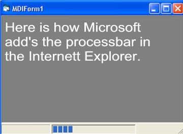

<div align="center">

## ProcessBar in Statusbar


</div>

### Description

Shows you how to build the processbar into the statusbar panels the easy way.
 
### More Info
 


<span>             |<span>
---                |---
**Submitted On**   |2004-05-23 13:07:02
**By**             |[Kjell T Dirdal](https://github.com/Planet-Source-Code/PSCIndex/blob/master/ByAuthor/kjell-t-dirdal.md)
**Level**          |Intermediate
**User Rating**    |5.0 (15 globes from 3 users)
**Compatibility**  |VB 6\.0
**Category**       |[Custom Controls/ Forms/  Menus](https://github.com/Planet-Source-Code/PSCIndex/blob/master/ByCategory/custom-controls-forms-menus__1-4.md)
**World**          |[Visual Basic](https://github.com/Planet-Source-Code/PSCIndex/blob/master/ByWorld/visual-basic.md)
**Archive File**   |[ProcessBar1749195232004\.zip](https://github.com/Planet-Source-Code/kjell-t-dirdal-processbar-in-statusbar__1-53970/archive/master.zip)

### API Declarations

```
Private Declare Function SetParent Lib "user32.dll" _
  (ByVal hWndChild As Long, _
ByVal hWndNewParent As Long) As Long
'SendMessage
Private Declare Function SendMessage Lib "user32.dll" Alias "SendMessageA" _
  (ByVal hWnd As Long, _
  ByVal wMsg As Long, _
  ByVal wParam As Long, _
  lParam As Any) As Long
```


